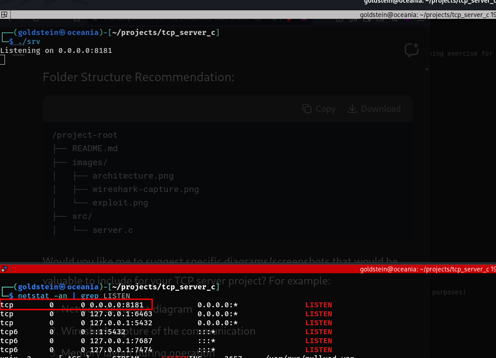
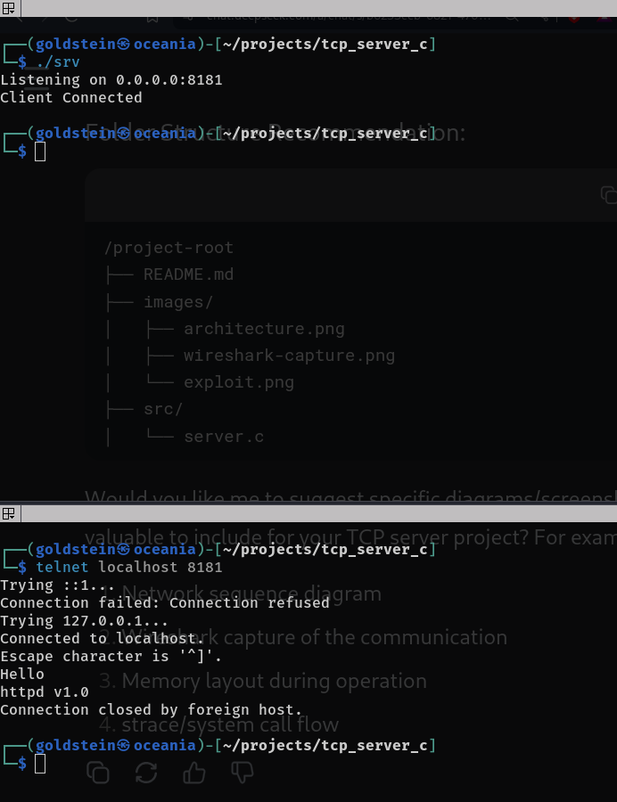

# Simple TCP Server in C

A minimal HTTP-like TCP server implementation in C, created as a learning exercise for network programming and offensive security research.

## Description

This project implements a basic TCP server that:
- Listens on port 8181
- Accepts a single connection
- Reads incoming data
- Responds with "httpd v1.0"
- Closes the connection

While functionally simple, this serves as:
- A foundation for understanding socket programming
- A testbed for network security experiments
- A starting point for more complex server implementations

## Technical Details

**Key Components:**
- IPv4 TCP socket (SOCK_STREAM)
- INADDR_ANY binding (0.0.0.0)
- Basic error handling
- Single-threaded, sequential processing

**Security Considerations:**
- No input validation
- Minimal error handling
- Single-client limitation
- Potential buffer overflow vulnerabilities (intentional for research purposes)

## Build & Run

```bash
gcc server.c -o server
./server

## Local Port Scan Result


